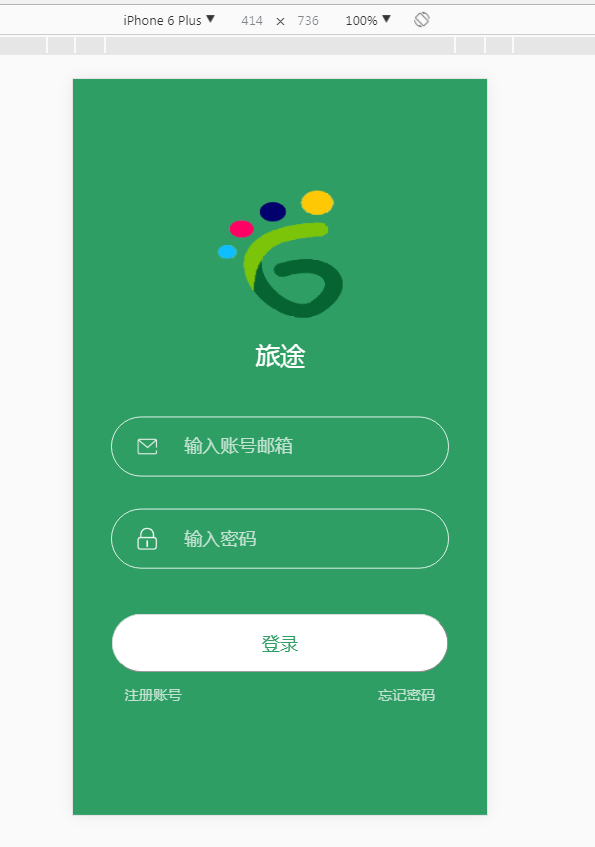
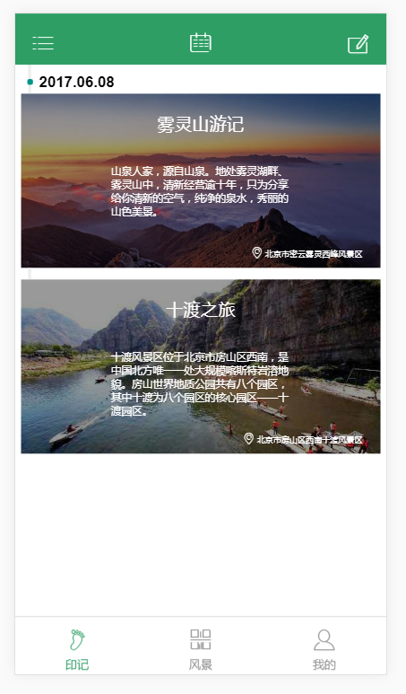
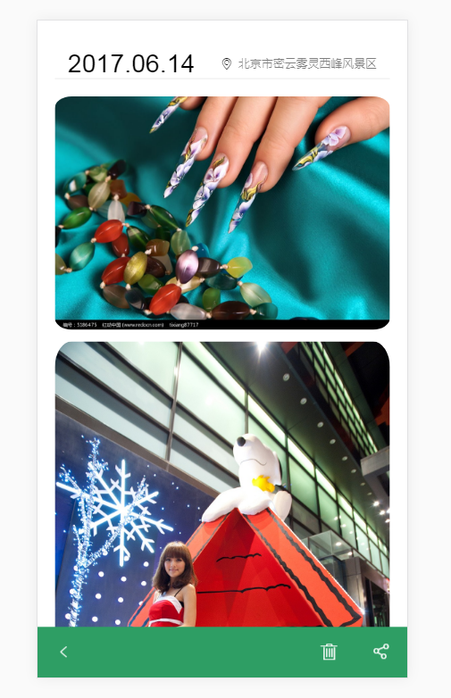
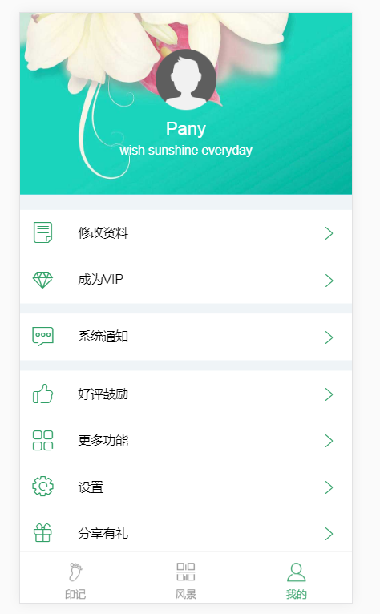

footmark
--------

----------

 - Technical points：vue2.0+Vuex+iconfont+rem+vue-router+axios
 - Build setup

``` bash
# 安装项目依赖包
npm install

# 启动本地服务器开发，访问地址：localhost:8080
npm run dev

# 编译生产环境
npm run build
```

 - login account：name:test.com & password：123
 - Screenshot：
 -


 

 

 

 

 
